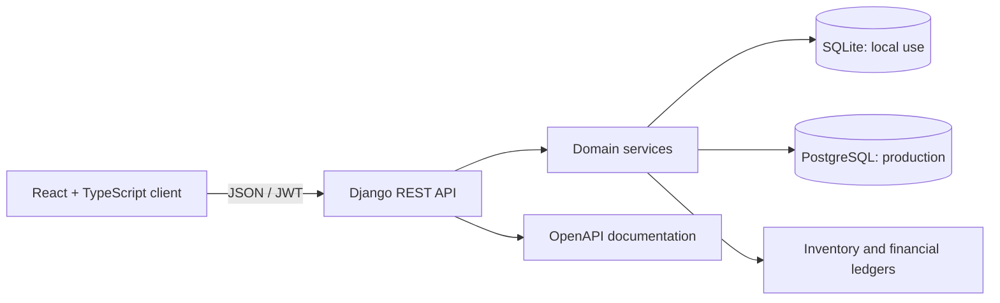

# Al-Amaan Pharmacy IMS

A full-stack pharmacy inventory, point-of-sale, customer debt, and financial accountability system for community pharmacy operations.

[](https://react.dev/)
[](https://www.typescriptlang.org/)
[](https://www.djangoproject.com/)
[](https://www.django-rest-framework.org/)
[](#database-strategy)
[](#license)

## Overview

Al-Amaan Pharmacy IMS connects day-to-day pharmacy operations to a consistent inventory and financial record. Sales, stock purchases, debt recovery, expenses, and cancellations are handled as transactional workflows so that stock, customer balances, and accountability records remain aligned.

The application supports two operating modes:

- **Local workstation:** React, Django, and SQLite on one Windows computer, with one-click startup and integrated backups.
- **Deployed environment:** a production React build, Django behind a production web server, and PostgreSQL for reliable concurrent transactions.

SQLite is the current local-development database. PostgreSQL is the required target before introducing multiple tills, concurrent staff, or production traffic.

## Core capabilities

| Area | Capabilities |
|---|---|
| Point of sale | Cash and credit sales, barcode lookup, stock validation, idempotent submission, cancellation, printable receipts, and QR-coded receipt references |
| Product catalogue | Categories, companies, generic products, company-specific variants, selling and cost prices, historical price adjustments, and active/inactive status |
| Inventory | Stock movement history, controlled adjustments, low-stock monitoring, and purchase-driven replenishment |
| Purchases | Stock purchase recording, automatic inventory increases, purchase history, cancellation, and matching financial postings |
| Customers and debt | Customer profiles, credit balances, debt allocation, recovery payments, and payment history |
| Accountability | Sales income, purchase spending, debt recovery, manual expenses, transaction references, and summary views |
| Reporting | Operational dashboard, sales and purchase summaries, inventory indicators, and business reports |
| Administration | Pharmacy and receipt settings, administrator/cashier access control, pending-user approval, password changes, and staff account management |
| Security | JWT authentication, refresh-token rotation and blacklisting, configurable inactivity logout, endpoint permissions, login throttling, and structured API errors |

## Architecture



Critical write operations use Django transactions. Sales and purchases update their business record, stock movements, and financial postings as one unit: either the complete workflow succeeds or it is rolled back. Mutating endpoints also support idempotency keys to prevent duplicate records after a retry.

Historical sale and purchase lines retain their captured descriptions and prices. Later catalogue edits therefore do not rewrite completed transaction history.

## Technology stack

| Layer | Technology |
|---|---|
| Frontend | React 19, TypeScript 5.8, Vite 6, Tailwind CSS 4 |
| UI and visualization | Lucide React, Motion, Recharts, jsPDF, qrcode |
| Backend | Python, Django 5.2, Django REST Framework 3.16 |
| Authentication | Simple JWT with refresh rotation and token blacklisting |
| API contract | drf-spectacular / OpenAPI 3 |
| Data | SQLite for single-workstation local use; PostgreSQL for production |
| Production serving | Gunicorn, Nginx, WhiteNoise |
| Testing | Django test runner, pytest, pytest-django, TypeScript compiler, Vite build |

## Quick start on Windows

### Prerequisites

- Windows 10 or 11
- Python 3.11 or newer
- Node.js 20 LTS or newer
- npm
- Git, if the repository has not already been downloaded

### 1. Get the source

```powershell
git clone https://github.com/Saeed-uthman/pharmacy-ims.git
cd pharmacy-ims
```

If the project is already on the computer, open PowerShell in its root folder instead.

### 2. Create the local configuration

```powershell
Copy-Item .env.example .env
```

The example configuration uses SQLite and the local addresses expected by the launcher. Do not commit the resulting `.env` file or place production secrets in source control.

### 3. Install the frontend

```powershell
npm install
```

### 4. Install and prepare Django

Run these commands from your own PowerShell or Command Prompt:

```powershell
cd alamaan_backend
py -m venv env
.\env\Scripts\Activate.ps1
python -m pip install --upgrade pip
pip install -r requirements.txt
python manage.py migrate
python manage.py createsuperuser
cd ..
```

PowerShell may initially block virtual-environment activation. If that happens, run `Set-ExecutionPolicy -Scope CurrentUser RemoteSigned`, reopen PowerShell, and activate the environment again.

### 5. Start the system

Double-click:

```text
Start Pharmacy System.cmd
```

The launcher:

1. verifies the Python environment and frontend installation;
2. creates and validates a local SQLite/media backup when one is due;
3. starts the Django API and Vite client in minimized windows;
4. waits for both health checks; and
5. opens `http://localhost:3000` in the default browser.

The launcher deliberately does not run migrations. Apply migrations yourself after pulling changes so that any migration failure remains visible.

## Manual development startup

Start the API in one terminal:

```powershell
cd alamaan_backend
.\env\Scripts\Activate.ps1
python manage.py migrate
python manage.py check
python manage.py runserver 127.0.0.1:8000
```

Start the frontend in a second terminal:

```powershell
npm run dev
```

| Service | Local address |
|---|---|
| Application | `http://localhost:3000` |
| API root | `http://127.0.0.1:8000/api/v1/` |
| Database health check | `http://127.0.0.1:8000/health/` |
| Swagger UI | `http://127.0.0.1:8000/api/v1/schema/swagger-ui/` |
| ReDoc | `http://127.0.0.1:8000/api/v1/schema/redoc/` |
| OpenAPI schema | `http://127.0.0.1:8000/api/v1/schema/` |
| Django administration | `http://127.0.0.1:8000/admin/` |

## Nigerian medicine starter catalogue

The repository includes an idempotent starter catalogue containing **132 generic medicine records across 17 categories**. It is intended to accelerate catalogue setup without inventing pack-level commercial data.

Preview the import first:

```powershell
cd alamaan_backend
.\env\Scripts\Activate.ps1
python manage.py seed_nigerian_medicines --dry-run
```

Import the complete catalogue:

```powershell
python manage.py seed_nigerian_medicines
```

Optional examples:

```powershell
# Trial import of the first 10 records
python manage.py seed_nigerian_medicines --limit 10

# Import one or more named categories
python manage.py seed_nigerian_medicines --category "Analgesics" --category "Antimalarials"

# Attribute new products to an existing administrator
python manage.py seed_nigerian_medicines --admin-email admin@example.com
```

Running the import again skips matching products. The command creates generic products and any missing categories; it does **not** create manufacturer variants, NAFDAC numbers, barcodes, prices, or opening stock.

> The catalogue is a setup aid, not proof that a brand or pack is currently registered, available, suitable for a patient, or permitted for over-the-counter sale. Verify every physical product against the current NAFDAC Greenbook and follow applicable Nigerian pharmacy and prescribing requirements before stocking it.

## Database strategy

### SQLite for local use

SQLite is suitable while the system runs on one computer for one active operator at a time. Keep the database on the computer's local disk; do not place the live `.sqlite3` file on a shared or cloud-synchronized folder.

Create a database-aware manual backup by double-clicking:

```text
Backup Pharmacy Data.cmd
```

The backup process creates a ZIP archive containing a consistent snapshot of the selected database, uploaded media, and an integrity manifest. Backup location and retention can be configured in `.env` with `PHARMACY_BACKUP_DIR`, `PHARMACY_BACKUP_RETENTION_DAYS`, and `PHARMACY_BACKUP_MIN_INTERVAL_HOURS`.

When `DB_ENGINE=postgresql`, the same launcher creates and validates a
custom-format `pg_dump` instead. Drag any generated ZIP onto `Verify Pharmacy
Backup.cmd` for a non-destructive checksum and structure check. Use `Rehearse
PostgreSQL Restore.cmd` only with a separate test database; it refuses the live
database name and never overwrites live media.

Run `Install Daily Backup Schedule.cmd` once to opt into a daily 8:00 PM
Windows backup task in addition to interval-controlled startup backups.

Backups are useful only after a restore has been tested. Periodically restore an archive on a separate test copy and confirm that Django can read the database and media files.

### PostgreSQL for concurrency and deployment

Move to PostgreSQL before any of the following:

- two or more users may sell or adjust the same stock concurrently;
- the application will serve multiple tills or computers;
- remote access or live deployment is introduced; or
- production-grade row locking and recovery are required.

SQLite does not implement Django's `select_for_update()` row locks, so the concurrency tests are intentionally skipped there. They must pass without skips on PostgreSQL before a production release.

Changing `DB_ENGINE` does not migrate existing data. Plan and verify a deliberate data transfer, reconcile record counts and financial totals, and retain a restorable pre-migration backup. See [Local and deployment guide](LOCAL_AND_DEPLOYMENT_GUIDE.md) and [Backend deployment guide](alamaan_backend/DEPLOYMENT.md).

## Verification

### Frontend checks

Run from the repository root:

```powershell
npm run lint
npm run build
```

### Django checks

Run these yourself from `alamaan_backend` with the virtual environment active:

```powershell
python manage.py makemigrations --check --dry-run
python manage.py check
python manage.py test
python -m pytest -q -p no:cacheprovider
python manage.py spectacular --file schema.yml --validate
```

Warnings for expected `400`, `401`, `403`, `405`, and `409` responses may appear while negative API tests run. They are test scenarios, not failures, when the suite ends successfully.

Run the PostgreSQL-only concurrency gate after switching databases:

```powershell
python manage.py test apps.common.tests.ConcurrentTransactionTests -v 2
```

The release checklist contains the required manual transaction and access-control checks: [Release acceptance](RELEASE_ACCEPTANCE.md).

## Configuration

All frontend, Django, database, security, backup, logging, and deployment settings are documented in [.env.example](.env.example). Important variables include:

| Variable | Purpose |
|---|---|
| `VITE_API_BASE_URL` | Browser-facing Django API base URL |
| `DJANGO_DEBUG` | Enables development behavior; must be `False` in production |
| `DJANGO_SECRET_KEY` | Required secret for a non-debug deployment |
| `DJANGO_ALLOWED_HOSTS` | Hostnames accepted by Django |
| `CORS_ALLOWED_ORIGINS` | Exact browser origins allowed to call the API |
| `DB_ENGINE` | `sqlite` locally or `postgresql` for deployment |
| `SQLITE_PATH` | Optional local SQLite database path |
| `DB_NAME`, `DB_USER`, `DB_PASSWORD`, `DB_HOST`, `DB_PORT` | PostgreSQL connection settings |
| `JWT_ACCESS_TOKEN_LIFETIME_MINUTES` | Access-token lifetime |
| `JWT_REFRESH_TOKEN_LIFETIME_DAYS` | Refresh-token lifetime |
| `PHARMACY_BACKUP_DIR` | Local backup destination |

Never reuse example secrets, wildcard hosts, or development CORS origins in production.

## Project structure

```text
pharmacy-ims/
|-- src/                              React application and API services
|-- alamaan_backend/
|   |-- apps/
|   |   |-- accounts/                 Authentication and staff management
|   |   |-- products/                 Catalogue, variants, and pricing
|   |   |-- inventory/                Stock movements and adjustments
|   |   |-- customers/                Customer accounts and debt payments
|   |   |-- sales/                    POS transactions and receipts
|   |   |-- purchases/                Procurement and stock replenishment
|   |   |-- accountability/           Financial ledger and expenses
|   |   |-- dashboard/                Operational dashboard API
|   |   |-- reports/                  Business reporting API
|   |   `-- settings_app/             Pharmacy and receipt settings
|   |-- config/                       Django settings, routes, and WSGI
|   |-- requirements.txt
|   `-- DEPLOYMENT.md
|-- scripts/                          Local startup and backup helpers
|-- deploy/                           Example Nginx and systemd definitions
|-- Start Pharmacy System.cmd         One-click Windows launcher
|-- Backup Pharmacy Data.cmd          On-demand local backup
|-- .env.example                      Configuration reference
|-- LOCAL_AND_DEPLOYMENT_GUIDE.md      Operations and database guide
|-- RELEASE_ACCEPTANCE.md              Release verification checklist
`-- DJANGO_BACKEND_DEVELOPMENT_BLUEPRINT.md
```

## Deployment

A production installation should use:

- a compiled frontend created with `npm run build`;
- Django served by Gunicorn or another production WSGI server;
- Nginx or an equivalent reverse proxy;
- PostgreSQL;
- HTTPS with secure proxy, cookie, and HSTS settings;
- scheduled `pg_dump` and media backups with restore rehearsals; and
- recurring cleanup for expired JWT records.

Example Nginx and systemd definitions are available under `deploy/`. Treat them as templates and replace all paths, users, domains, and secrets for the target server.

Before release, run Django's deployment checks and the complete acceptance gate described in [Backend deployment guide](alamaan_backend/DEPLOYMENT.md).

## Documentation

| Document | Purpose |
|---|---|
| [Local and deployment guide](LOCAL_AND_DEPLOYMENT_GUIDE.md) | Local Windows operation, backup/restore, SQLite limits, and PostgreSQL deployment path |
| [Backend deployment guide](alamaan_backend/DEPLOYMENT.md) | Production environment, migration, static files, security checks, and operational jobs |
| [Release acceptance](RELEASE_ACCEPTANCE.md) | Automated and manual verification checklist |
| [Django backend development blueprint](DJANGO_BACKEND_DEVELOPMENT_BLUEPRINT.md) | Original phased backend integration design and implementation reference |
| [.env.example](.env.example) | Complete environment-variable reference |

## Operational and security notes

- Use individual staff accounts; never share administrator credentials.
- Keep `.env`, database files, media, and backups outside version control.
- Administrative API mutations are recorded in the immutable audit trail. Administrators can review it at `GET /api/v1/audit-events/`; filters include `action`, `outcome`, and `actor`.
- Application and audit logs are written as rotating JSON files under `alamaan_backend/logs` by default. Use the response `X-Request-ID` to correlate a browser error with server and audit logs.
- Run `python manage.py prune_audit_events --dry-run` before scheduling `python manage.py prune_audit_events`. Retention defaults to 365 days and cannot be configured below 30 days.
- Restrict administrator-only actions such as purchases, settings, reporting, inventory adjustment, and staff approval.
- Verify physical medicine details, current NAFDAC registration, prices, storage requirements, and prescription controls before use.
- Reconcile daily sales, purchases, customer debt, stock movements, and accountability totals.
- Use **Current Business Funds** for the combined amount presently held by the shop. It is calculated as opening balance plus owner capital plus all completed receipts, less purchases, expenses, refunds, and owner withdrawals.
- **Net Cash Generated** excludes opening balance, owner capital, and owner withdrawals. It measures operational cash generation for the selected period and is not accounting profit.
- Run `python manage.py reconcile_business_funds` after restoration, before release, and whenever dashboard and physical cash totals appear inconsistent. The command is read-only and fails on missing, duplicate, orphaned, or mismatched owner-fund ledger entries.
- Protect backups as sensitive business and customer data, and test restoration regularly.

## Final release gate

Double-click `Run Release Readiness Check.cmd` to run the system check, migration-drift check, OpenAPI validation, hardened production security check, business-funds reconciliation, full Django suite, frontend type checking and production build, and verification of the newest backup. The runner does not migrate or modify business data.

After the automated gate passes, complete [RELEASE_UAT_CHECKLIST.md](RELEASE_UAT_CHECKLIST.md) with the pharmacy owner. Automated tests do not replace receipt inspection, permission checks, financial reconciliation, backup restoration, or workflow acceptance on the intended computer.

## License

This repository is proprietary software. No permission is granted to copy, redistribute, sublicense, or deploy it outside the owner's authorized environment without explicit written approval.

Copyright (c) 2026 Al-Amaan Pharmacy. All rights reserved.
